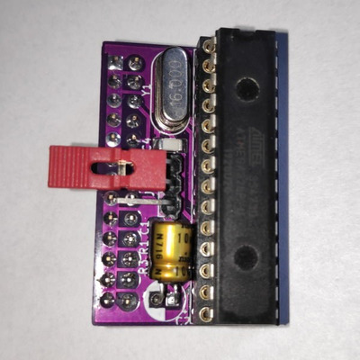
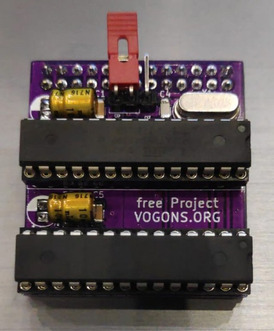

## BeepBlaster

BeepBlaster is a minimalist hardware sound device designed for retro PC MIDI setups.
It focuses on a puristic lo-fi sound aesthetic while maintaining full General MIDI compatibility.

The device is built for systems with a WaveBlaster header, allowing it to be installed directly on compatible sound cards. Instead of emulating classic synthesizers, BeepBlaster intentionally produces a distinctive raw mono sound that fits well with retro computing environments and DOS games.

Two hardware revisions currently exist: BeepBlaster 1.0 and BeepBlaster 2.0.

# BeepBlaster 1.0

BeepBlaster 1.0 is the original and most minimal implementation.

It is based on a single ATmega328P microcontroller and generates a puristic mono lo-fi sound while supporting the full General MIDI (GM) specification with 16 channels.

Characteristics

ATmega328P based design

Full General MIDI compatibility (16 channels)

Mono output with a distinctive lo-fi character

Designed for WaveBlaster header compatibility

Very small and simple hardware design

The goal of version 1.0 is simplicity: minimal hardware, deterministic behavior, and a characteristic retro sound.

## BeepBlaster 2.0

BeepBlaster 2.0 expands the concept while keeping the same basic architecture.

The design uses two ATmega328P microcontrollers to add stereo support, allowing a wider and more dynamic sound compared to the original mono version.

Characteristics:

- Dual ATmega328P architecture

- Stereo output

- Full General MIDI compatibility (16 channels)

- WaveBlaster header compatible

Version 2.0 keeps the same philosophy as the original hardware but offers improved spatial sound.

Operating Modes:

The board includes a jumper selection that controls the operating mode.

Jumper	Mode	Description:
- 1–2	BeepBlaster Mode	Puristic lo-fi sound
- 2–3	Beeptable Synthesizer	Higher quality sound mode

Design Goals

Simple and deterministic hardware

Direct compatibility with WaveBlaster MIDI interfaces

Full GMIDI playback

Distinctive retro lo-fi sound

Minimal component count

Contributions, ideas, and testing feedback are welcome.
